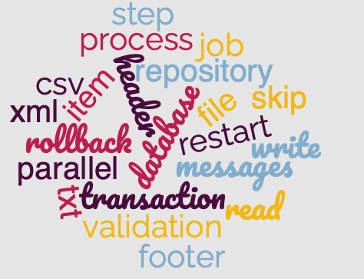

= Scaling Batch Jobs

~#Rodrigo&nbsp;Graciano#~ &nbsp; &nbsp; &nbsp; &nbsp; &nbsp; &nbsp; &nbsp; &nbsp;&nbsp; &nbsp; &nbsp; &nbsp;&nbsp; &nbsp; &nbsp; &nbsp;&nbsp; &nbsp; &nbsp; &nbsp;~#link:https://twitter.com/rodrigograciano[@rodrigograciano]#~ &nbsp; &nbsp; &nbsp; &nbsp;

'''

|===
| link:deck/docs/RodrigoGraciano.adoc[◀️ #Rodrigo Graciano#]
| &nbsp;
| link:deck/docs/01_SpringBatch.adoc[#Spring Batch# ▶️]
|===