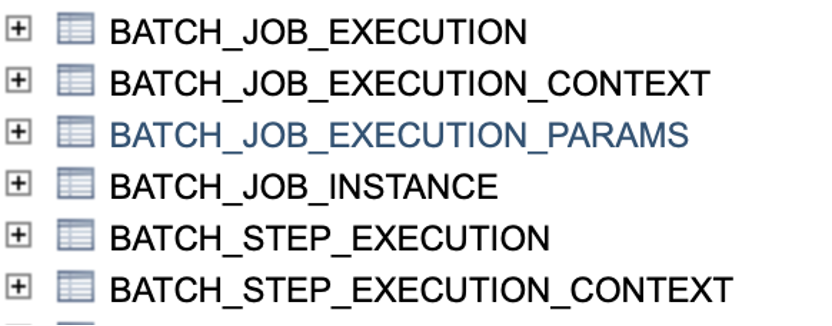

= Job Repository

=== Responsible for the persistence layer
=== Spring Batch needs the following schema
=== This is how it keeps track of jobs, their statuses, and needed for restartability

&nbsp;

'''

|===
| link:02_FirstJob.adoc[◀️ #First Job#] &nbsp;&nbsp;&nbsp;&nbsp;&nbsp;&nbsp;&nbsp;&nbsp; link:04_Annotations.adoc[#Configuration# ▶️]
|===