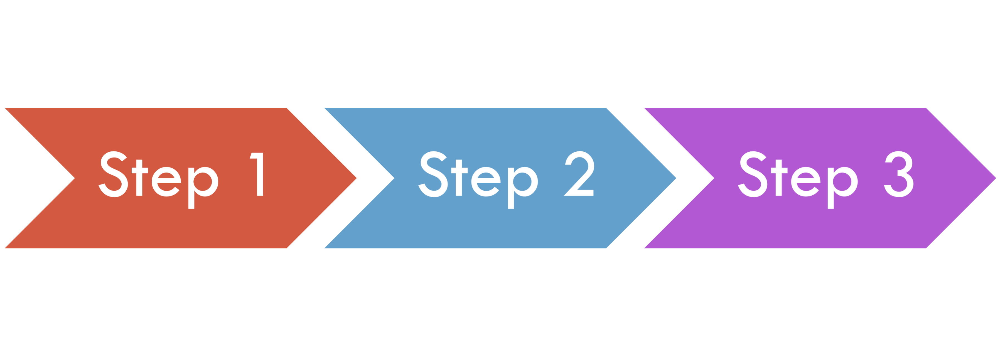
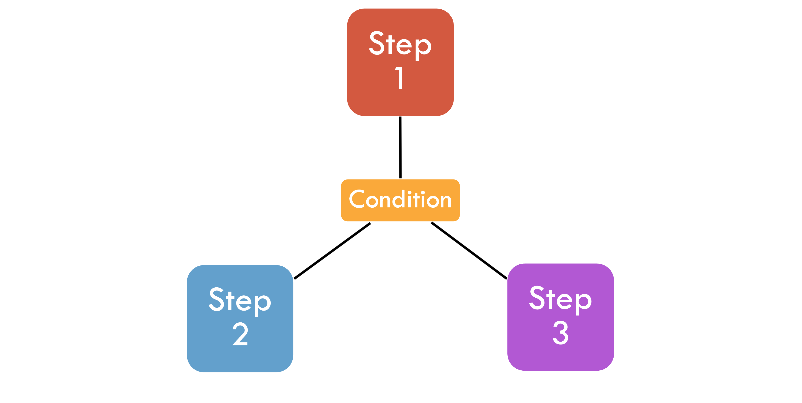
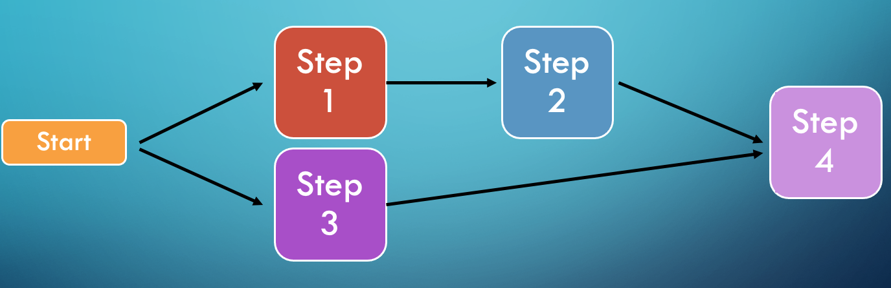

= Parallel Steps

A job can have multiple steps, and there are different ways that they can be executed.

Sequential Flow

Conditional Flow (and Decider Flow)

Split Flow

'''

|===
| link:10_Scaling.adoc[◀️ #Scaling Jobs#] &nbsp;&nbsp;&nbsp;&nbsp;&nbsp;&nbsp;&nbsp;&nbsp; link:12_Async.adoc[#Async Processor & Writer# ▶️]
|===