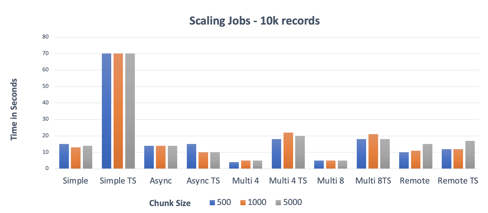

= Benchmark

## With 10k Records

## With 100k Records

image:../images/performance-100k.png[100kRecordsBenchmark]

'''

|===
| link:16_RunningTheExamples.adoc[◀️ #Running the Examples#] &nbsp;&nbsp;&nbsp;&nbsp;&nbsp;&nbsp;&nbsp;&nbsp; link:../../README.adoc[#Start# 🔼]
|===

